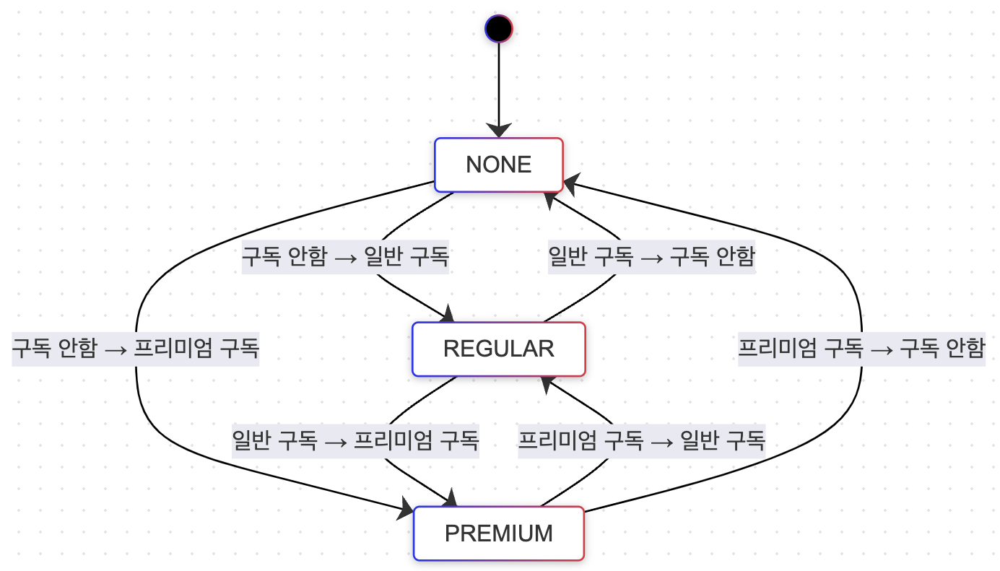

# ARTINUS - Channel Subscription Service

[TOC]


## 1. 설계

### 1.1. 구독 상태 관리

[구독 상태를 State Diagram으로 표현](./docs/subscription-state-diagram.md)




------


### 1.2. 헥사고날 아키텍처 (Hexagonal Architecture)


#### 1.2.1. 헥사고날 아키텍처의 기본 개념

헥사고날 아키텍처는 애플리케이션의 핵심 비즈니스 로직(도메인 로직)을 외부 시스템과 분리하여 관리하는 구조이다. 이 아키텍처는 주로 다음과 같은 요소들로 구성된다:


1. **도메인(Core Domain)**
   - 핵심 비즈니스 로직이 구현되는 영역이다. 여기에는 도메인 모델, 도메인 서비스, 애그리게잇 등이 포함된다.
2. **포트(Ports)**
   - 외부에서 도메인에 접근할 수 있는 인터페이스이다. 예를 들어, 서비스와 도메인 계층 간의 상호작용을 정의한다. 포트는 도메인 로직과 외부 시스템 간의 의존성을 반대로 바꾸는 역할을 한다.
3. **어댑터(Adapters)**
   - 포트를 통해 외부 시스템과 상호작용하는 구현체이다. 예를 들어, 데이터베이스 접근, 외부 API 호출, 사용자 인터페이스(UI) 등을 처리한다. 어댑터는 외부 시스템에 맞춰 포트를 구현하는 역할을 한다.


#### 1.2.2. 헥사고날 아키텍처의 구성요소


**1. 도메인 계층 (Core Domain)**

- **도메인 모델**: 구독 상태 전환과 관련된 모든 비즈니스 로직이 이 계층에 위치한다. 예를 들어, Subscription, User, Channel 엔티티와 이들 간의 비즈니스 규칙이 포함된다.
- **도메인 서비스**: 비즈니스 규칙을 처리하는 서비스 클래스들이 위치한다. 이 서비스들은 애플리케이션의 핵심 비즈니스 로직을 수행하며, 외부 시스템에 의존하지 않는다.


**2. 포트 (Ports)**

- **입력 포트 (Input Ports)**: 애플리케이션 서비스가 도메인 계층과 상호작용할 수 있는 인터페이스이다. 예를 들어, 구독하기, 구독해지 등의 기능을 수행하는 인터페이스들이 위치한다.
- **출력 포트 (Output Ports)**: 도메인 계층에서 외부 시스템과 상호작용할 수 있는 인터페이스이다. 예를 들어, 데이터베이스에 접근하기 위한 리포지토리 인터페이스들이 포함된다.


**3. 어댑터 (Adapters)**

- **입력 어댑터 (Input Adapters)**: API, 사용자 인터페이스(UI), 메시지 큐 등을 처리하는 구현체들이다. 입력 어댑터는 애플리케이션 서비스와 상호작용하며, 외부 요청을 처리하고 도메인 로직에 전달한다.
- **출력 어댑터 (Output Adapters)**: 출력 포트를 구현하여 외부 시스템(데이터베이스, 외부 API 등)과 상호작용한다. 예를 들어, JPA 리포지토리, Redis와의 연결 등이 포함된다.


**4. 애플리케이션 계층 (Application Layer)**

- **애플리케이션 서비스**: 도메인 계층과 외부 시스템 간의 중개 역할을 한다. 이 서비스들은 비즈니스 로직을 실행하고, 포트와 어댑터를 통해 외부 시스템과 상호작용한다.


**헥사고날 아키텍처 (Hexagonal Architecture)의 장점**


#### 1.2.3. 비즈니스 로직의 독립성

- **구독 상태 관리의 명확성**: 구독 서비스에서는 사용자의 구독 상태(예: 구독 안함, 일반 구독, 프리미엄 구독)를 중심으로 다양한 비즈니스 로직이 필요하다. 헥사고날 아키텍처를 사용하면, 이 핵심 비즈니스 로직을 외부 시스템(예: 데이터베이스, 외부 API)과 독립적으로 관리할 수 있어, 구독 상태 전환 로직이 외부 시스템 변경에 영향을 받지 않는다.
- **비즈니스 로직의 변경 용이성**: 구독 상태 전환 규칙이나 새로운 구독 타입을 추가해야 할 때, 헥사고날 아키텍처는 이러한 변경을 쉽게 적용할 수 있다. 비즈니스 로직은 외부 어댑터와 독립적이기 때문에, 외부 의존성 없이 쉽게 수정하고 테스트할 수 있다.


#### 1.2.4. 유연한 확장성

- **채널 추가 및 관리의 유연성**: 구독 서비스는 여러 외부 서비스나 플랫폼을 채널로 활용해야 한다. 헥사고날 아키텍처에서는 이러한 채널들을 어댑터로 쉽게 추가할 수 있다. 새로운 채널을 추가하더라도, 핵심 비즈니스 로직은 변경 없이 유지되며, 어댑터만 추가하거나 수정하면 된다.
- **다양한 인터페이스 지원**: 구독 관리 API 외에도, 웹 UI, CLI 등 다양한 인터페이스를 쉽게 통합할 수 있다. 헥사고날 아키텍처에서는 각 인터페이스를 독립된 어댑터로 구현하여, 비즈니스 로직과 상호작용할 수 있다.


#### 1.2.5. 테스트 용이성

- **테스트의 독립성**: 구독 서비스에서 API나 비즈니스 로직을 테스트할 때, 외부 시스템(예: 데이터베이스, 외부 서비스)에 의존하지 않고 독립적으로 테스트할 수 있다. 이는 헥사고날 아키텍처의 주요 장점 중 하나로, 모의 객체(Mock)를 사용하여 외부 의존성을 대체할 수 있다.
- **상태 전이 테스트**: 구독 상태 전환의 테스트는 복잡할 수 있다. 헥사고날 아키텍처는 상태 전이 로직을 명확히 분리하므로, 다양한 상태 전이를 독립적으로 테스트할 수 있어 테스트 커버리지가 향상된다.


#### 1.2.6. 의존성 역전 원칙(DIP, Dependency Inversion Principle)의 실현

**구독 서비스의 핵심 로직 보호**: 헥사고날 아키텍처에서는 비즈니스 로직이 외부 시스템에 의존하지 않고, 반대로 외부 시스템이 비즈니스 로직에 의존하게 설계된다. 이는 구독 서비스의 핵심 로직을 외부 변화로부터 보호하고, 안정성을 유지하는 데 도움이 된다.


#### 1.2.7. 유지보수 및 확장 용이성

- **새로운 기능 추가의 용이성**: 헥사고날 아키텍처는 모듈화된 구조를 가지고 있어, 새로운 구독 상태나 채널 타입을 추가할 때 기존 구조를 크게 변경할 필요가 없다. 예를 들어, 새로운 구독 상태(예: VIP 구독)를 추가하는 경우, 비즈니스 로직에만 집중하여 확장할 수 있다.
- **비즈니스 로직의 재사용성**: 외부 시스템과의 결합도가 낮기 때문에, 구독 관리 로직을 다른 애플리케이션에서도 재사용할 수 있다. 이는 코드의 재사용성을 높이고, 유지보수성을 향상시킨다.


#### 1.2.8. 동시성 이슈 처리의 용이성

- **동시성 이슈 관리**: 다중화 환경에서 구독 상태 관리와 관련된 동시성 이슈를 처리할 때, 헥사고날 아키텍처는 비즈니스 로직을 별도로 관리함으로써 동시성 문제를 특정 어댑터 또는 서비스에서 집중적으로 처리할 수 있게 한다. 이는 동시성 문제를 해결하는 데 있어 구조적 장점을 제공한다.


#### 1.2.9. 결론

헥사고날 아키텍처를 사용하면 구독 서비스의 비즈니스 로직을 외부 시스템과 독립적으로 관리할 수 있어, 유지보수성과 확장성이 뛰어난 애플리케이션을 설계할 수 있다. 특히, 구독 서비스와 같이 상태 전환이 중요한 비즈니스 로직이 있는 시스템에서는, 이러한 아키텍처가 큰 이점을 제공한다. 이는 복잡한 비즈니스 로직을 안전하고 효율적으로 관리하는 데 매우 효과적이다.


## 2. 구현

### 2.1. 다중화 환경에서의 R-DB 기본키 전략

보통 개발 편의성을 위해 Oracle의 Sequence, MySQL의 auto_increment 로 숫자를 1씩 증가시키는 것으로 만든다.

이것은 어떤 문제점이 있을까?

1. 외부에서 해당 시스템 PK를 예측하기 쉬워져서 **SQL Injection 문제**
2. Sequence, auto_increment는 중앙 집중식으로 값을 생성하는 방식이므로 **DB에 의존적이게 되어 확장성이 제한되는 문제**
3. 서비스 폭풍성장 시, **ID 고갈되는 문제** (BIGINT 최댓값은 4,294,967,295 이고, unsigned BIGINT라면 18,446,744,073,709,551,615)
4. 데이터베이스 **변경의 어려움**
5. DB가 2대 이상일 때 **중복 문제**

 

> 💡 MySQL 5.7 이하 버전에서는 AUTO_INCREMENT counter 값을 메모리에 저장하였기에 재기동한다면 이 값이 소멸된다. 따라서 0부터 시작하게되는 문제가 발생한다.
>
> 💡 MySQL 8.0 이후부터는 AUTO_INCREMENT counter 값을 디스크에 저장하는 방식으로 변경되었다.(redo log에 저장) 따라서 재기동되더라도 counter값이 남아있기에 중복문제가 발생하지 않는다.

 

> 분산환경에서 유일성이 보장되는 ID를 만드는 방법은 어떠한 것이 있을까?

 

#### 2.1.1. 다중 마스터 복제(multi-master replication)


다중 마스터 복제 예시


- DB의 auto_increment 기능을 활용하고, 1씩 증가하는 것이 아닌 서버의 수 k만큼 증가시키는 방법
- 각 DB서버가 다음에 만들 ID값은 자신이 생성한 이전 ID값에 전체 서버의 수 k를 더한 값
  - 위 그림에서는 DB서버가 2개이므로 k = 2 가 됨
- 규모 확장성을 어느정도 해결


##### 단점

- 여러 데이터 센터에 걸쳐 확장 어려움
- 시간 흐름에 맞춰 ID값을 커지도록 보장할 수 없음
- 서버 추가 및 삭제 할 때도 잘 동작하도록 만들기 어려움

 

#### 2.1.2. UUID

> UUID값 예시 : bb6266a8-09aa-4c90-b597-05f1cc958acd

- 컴퓨터 시스템에 저장되는 정보를 유일하게 식별하기 위한 128비트짜리 수
- UUID 값은 충돌 가능성이 매우 낮음 (중복 확률 0.00000000006% 인데 운석 맞을 확률임)
- 서버 간 조율 없이 독립적으로 생성 가능
- 알파벳은 소문자로 표현되며, 입력시 대소문자를 구분하지 않음

##### 장점

- UUID 생성은 간단
- 동기화 이슈 X
- 규모 확장 쉬움

##### 단점

- ID값이 128비트로 길며, 용량도 큼
  - 대규모 테이블에서 저장공간 많이 차지
- 시간순 정렬 X
- 숫자가 아닌 값 포함
- UUID 값은 문자 단위로 비교되기 때문에, 정수와 비교하면 성능이 느림 (2.5배 ~ 28배 성능 저하)
- MySQL(innoDB) 인덱스는 B+Tree 구조로써 순차성에 강한데, UUID는 랜덤이므로 성능 저하가 크게 발생 가능

> InnoDB는 기본키(PK)의 B+Tree에 테이블 행을 저장한다.이를 클러스터형 인덱스(clustered index)라고 부른다. 클러스터형 인덱스는 기본키를 기준으로 자동으로 행의 순서를 지정한다. 그런데 무작위 UUID를 가진 행을 삽입하면 여러 문제가 발생할 수 있어 성능 저하를 초래한다. 이와 관련된 내용은 아래 참고자료를 살펴보자.

 

##### 참고자료

- [UUID는 인기가 있지만 성능에는 좋지 않습니다](https://www.percona.com/blog/uuids-are-popular-but-bad-for-performance-lets-discuss/)
- [데이터베이스 기본키에 가장 적합한 UUID 유형](https://vladmihalcea.com/uuid-database-primary-key/)

 

#### 2.1.3. ULID

([ULID Github 링크](https://github.com/ulid/spec))


https://blog.daveallie.com/ulid-primary-keys


- UUID와 많이 유사하며, 128bit 용량을 가짐
- 앞의 Timestamp(타임스탬프)가 48bit 사용하므로 시간순 정렬 가능
  - 기원시간인 Epoch(밀리초)로 시간을 인코딩
- 뒤의 Randomness(무작위성)은 80bit를 가짐
- 밀리초의 정밀도를 가지며, 단순하게 증가
- 밀리초 내에 동시 생성되면 무작위성에 따라 순서가 달라짐

##### 장점

- UUID의 단점을 해결하기 위해 만들어짐
- UUID의 36문자와 달리 ULID는 26문자로 인코딩됨
  - UUID는 Base16, ULID는 Base32 문자 집합을 사용하기 때문에 ULID가 더 짧은 문자열을 가짐
- 특수 문자 없음 (URL 안전)
- 대소문자 구분하지 않음
- 시간순 정렬 가능
- 효율성과 가독성을 위해 Crockford의 Base 32 사용
  - "I", "L", "O", "U" 제외됨
  - 문자당 5bit

##### 단점

- 128bit로 상대적으로 용량이 큼

> Base32는 Base16보다 더 많은 정보를 한 문자에 담을 수 있기 때문에 ULID가 문자열이 26자로 표현된다. Base16은 16진수로 표현된 데이터를 나타내며, 각 문자는 4비트를 나타낸다. 128bit(16byte)의 데이터를 Base16으로 표현하면 32자의 문자열이 필요하다. 반면에 Base32는 각 문자가 5비트의 정보를 표현하고, 128bit 데이터를 26자의 문자열만으로 표현할 수 있다.

> 💡 UUID는 Base16이므로 32문자로 표현할 수 있지만 특수문자인 하이픈(`-`)이 4개 추가되기 때문에 총 36문자이고, ULID는 특수문자가 없기 때문에 온전히 26문자로 표현이 가능하다. 이것이 UUID와 ULID를 구별짓는 중요한 차이 중 하나이다.


 

#### 2.1.4. 트위터 스노플레이크(snowflake) 접근법

> 트위터는 고가용성 방식으로 초당 수만 개의 ID를 생성할 수 있는 것이 필요했고, 이러한 ID는 대략적으로 정렬 가능해야 하며, 64bit의 용량을 가져야 한다. MySQL 기반 티켓 서버는 일종의 재 동기화 루틴을 구축해야 했고, 다양한 UUID는 128bit가 필요했다. 따라서 대략적으로 정렬된 64bit 용량을 가진 ID를 생성하기 위해 타임 스탬프(timestamp), 작업자 번호(worker number) 및 시퀀스 번호(sequence number)의 구성을 결정했다. 시퀀스 번호는 스레드별로 지정되며, 작업자 번호는 시작 시 Zookeeper를 통해 선택된다. [[원문링크](https://blog.twitter.com/engineering/en_us/a/2010/announcing-snowflake)] [[Github 링크](https://github.com/twitter-archive/snowflake)]

- 트위터(twitter)가 OSS(Open Source System, 오픈소스)로 공개한 ID 생성기(generator)
- Time-base 한 ID (시간대별 정렬 가능하며, 의미를 가지는 ID)
- 확장 가능하며, 병렬로 유일성을 가진 ID 생성 가능
- 생성해야 하는 ID 구조를 여러 영역(section)으로 분할하여 사용


twitter snowflake(트위터 스노우플레이크) 예시


##### 스노우플레이크 구조 설명

- 사인(sign) 비트
  - 1bit 할당
  - 음수와 양수를 구별하는 데 사용
- 타임스탬프(timestamp)
  - 41bit 할당
  - 기원 시각(epoch) 이후로 몇 밀리초(millisecond)가 경과했는지 나타내는 값
  - 41bit로 표현할 수 있는 타임스탬프 최댓값은 2^41 - 1 = 2199023255551ms
  - 최댓값은 69년이므로 이 생성기는 69년동안 정상 작동
  - 시간의 흐름에 따라 큰 값을 가지게 되므로 결국 ID는 시간순 정렬 가능.
- 데이터센터(datacentor) ID
  - 5bit 할당
  - 2^5 = 32개 데이터센터 지원 가능
- 서버(server) ID
  - 5bit 할당
  - 데이터센터당 32개 서버를 사용 가능
- 일련번호(sequence number)
  - 12bit 할당
  - 12bit이므로, 2^12 = 4096개의 값을 가질 수 있음
  - 각 서버에서는 ID 생성할 때마다 이 일련번호를 1만큼 증가
  - 일련번호는 1밀리초가 경과할 때마다 0으로 초기화(reset)
  - 즉, 1밀리초 내에 두 개 이상의 ID를 생성하지 않는 한 이 영억은 일반적으로 0 이다

> 데이터센터ID와 서버ID는 시스템 시작 시 결정되며, 일반적으로 시스템 운영 중에는 바뀌지 않음.
> 타임스탬프나 일련번호는 ID 생성기가 돌고 있는 중에 만들어지는 값.

 

##### 장점

- 프로세스당 초당 최소 10,000개 ID 생성
- 응답 속도 2ms (네트워크 대기 시간 추가)
- 시계열(시간순, 날짜순) 정렬 가능
- UUID 128bit에 비해 64bit로 상대적으로 적으면서 많은 id 생성 가능
- 독립적으로 ID 생성 가능하므로 분산환경에서 확장성 높음
- 병렬로 유일한 ID 생성 가능

##### 단점

- 69년동안 사용가능함
- 중~소규모에서 운영할 때는 trade-off를 생각해야 함
  - sequence 또는 auto_increment에 비해 용량이 크기때문에 비용이 상대적으로 높음
  - 서비스가 폭풍성장한다면 DB구조변경, 데이터 마이그레이션, 동시성 문제같은 여러 비용을 생각한다면 미리 만드는것이 좋을수 있음

 

#### 2.1.5. TSID(Time-Sorted Unique Identifier)

([TSID Github 링크](https://github.com/f4b6a3/tsid-creator))

- [twitter의 snowflake](https://github.com/twitter-archive/snowflake/tree/snowflake-2010)와 [ULID Spec](https://github.com/ulid/spec)의 아이디어를 결합한 것
- 64bit 정수 생성 가능
- 문자열 형식은 Crockford의 base32로 저장
- 문자열은 URL 형식을 구분하지 않음
- UUID, ULID, KSUID보다 짧음
- 13자의 문자(13 chars)로 저장 가능


TSID 구조


##### TSID 구조

- 시간(Time component) 42bit 와 랜덤구성요소(Random component) 22bit 로 이루어짐
- 시간구성요소는 2020-01-01 00:00:00 UTC 이후의 밀리초 수
- 랜덤구성요소는 노드ID(node ID)의 0~20bit와 카운터(counter)의 2~22bit로 이루어짐
  - e.g. 노드 비트가 10이면 카운터 비트는 12로 제한되는 것
- 시간구성요소는 부호 있는 64bit 정수 필드에 저장되면 약 69년 동안 사용 가능
- 시간구성요소는 부호 없는 64bit 정수 필드에 저장되면 약 139년 동안 사용 가능


##### 장점

- 64bit(8 byte)로 UUID에 비해 상대적으로 적은 용량
- DB에 bitint로 저장하고, Java에서 long 사용 가능
- UUID와 기존 정수 기반 ID 모두 활용 가능
- 기본키를 바이트 배열 대신 읽을 수 있는 정수(64bit)로 가져옴
- 시계열 정렬이 가능해서 DB 성능 저하가 발생하지 않음
- JPA와 Hibernate에서 구현되었기에 매우 간단하게 사용 가능


##### 단점

- 69년 또는 139년동안만 사용가능함


##### 참고자료

- [DB의 기본키는 무엇을 사용해야 할까? ID와 UUID 외에 다른 것이 있을까?](https://www.linkedin.com/pulse/primary-keys-db-what-use-id-vs-uuid-something-else-lucas-persson/)
- [JPA 및 Hibernate를 사용하여 TSID 엔티티 식별자를 생성하는 가장 좋은 방법](https://vladmihalcea.com/tsid-identifier-jpa-hibernate/)
- [데이터베이스 기본키에 가장 적합한 UUID 유형](https://vladmihalcea.com/uuid-database-primary-key/)

 

##### JPA & Hibernate 엔티티에서 사용방법

Spring Boot 3 버전을 사용할 경우 Hibernate 6 버전을 사용한다.

따라서 아래 코드를 build.gradle의 dependencies(의존성)에 추가하자.

(아래 코드의 맨 마지막 버전은 자기 프로젝트 호환성에 맞게 고쳐도 됨)

> implementation 'io.hypersistence:hypersistence-utils-hibernate-60:3.5.1'

 

위 라이브러리를 추가했다면 이제 `@Tsid` 어노테이션만 사용하면 아주 간단하게 구현이 되었다.

```java
import io.hypersistence.utils.hibernate.id.Tsid;
import jakarta.persistence.Id;

public class TestEntity {

    @Id @Tsid
    private Long id;

    private String title;
}
```

 

[Hypersistence Utils 프로젝트](https://github.com/vladmihalcea/hypersistence-utils/)는 Spring과 Hibernate 모두를 위한 범용 유틸리티를 제공하는데 여기에 TSID가 구현되어있기 때문이다. Hypersistence Utils 3.2 버전부터 시간정렬식별자(tsid)를 제공하고 있다.

 

이 외에도 Hibernate 5에서 사용하거나 TSID 값 생성기를 커스터마이징 하고 싶으면 [이 글](https://vladmihalcea.com/tsid-identifier-jpa-hibernate/)을 참고하자.

TSID 값만 생성하는 것이 필요하다면 [TSID Github](https://github.com/f4b6a3/tsid-creator/)를 의존성 추가하여 사용하자.

 

#### 2.1.6. 결론

- 외부에 왠만하면 추측가능한 ID를 노출하지 않는게 좋음 (엔티티를 외부에 노출하지 않듯이)
  - e.g. "/users/109" 보다는 "/users/38352658568129975" 또는 "/users/01294A2BDA2"
  - 외부 노출용 ID를 따로 생성해서 내부 pk와 키-값으로 연결하여 주고받거나, 내부 pk를 암호화하는 방법도 있음
- "이게 제일 좋다!" 라는 것은 없고 상황마다 적절한 것을 trade-off 하여 사용하여야함
  - e.g. 내부적으로 사용하는 것이라면 굳이 PK를 UUID, TSID로 사용할 필요 없이 auto_increment 사용
  - e.g. 숫자는 문자열에 비해 작은 크기를 가지므로 저장 및 검색 속도에서 좋고, 문자열은 복잡하게 구성 가능
- 분산환경에서는 UUID의 단점을 개선한 TSID, snowflake 를 사용하는 것이 좋음
  - 각 서버가 독립적으로 유일성이 보장된 ID를 생성할 수 있기 때문
- **DB가 2대 이상 확장될 수 있는 가능성이 있다면 auto_increment보단 TSID, snowflake이 좋음**


### 2.2. 유한 상태 기계 (Finite State Machine)

Spring State Machine을 사용하여 유한 상태 기계를 구현할 때의 이점은 다음과 같다


#### 2.2.1. 명확한 상태 관리

- **복잡한 상태 전이 관리**: 구독 서비스에서 사용자의 구독 상태는 구독 안함, 일반 구독, 프리미엄 구독과 같은 다양한 상태로 전환된다. Spring State Machine을 사용하면 상태 전이를 명확하게 정의하고, 상태 간 전환을 자동으로 관리할 수 있어 복잡한 상태 전이 로직을 체계적으로 처리할 수 있다.
- **가독성 향상**: 상태 전이가 코드 내에 명시적으로 정의되므로, 코드의 가독성이 향상된다. 상태와 전이 이벤트를 별도로 정의하고 관리할 수 있어 비즈니스 로직을 쉽게 이해하고 유지보수할 수 있다.


#### 2.2.2. 상태 전이에 대한 명확한 트리거 관리

- **이벤트 기반 상태 전이** : Spring State Machine은 특정 이벤트에 따라 상태를 전환할 수 있도록 지원한다. 예를 들어, 구독하기, 업그레이드, 구독 해지 등의 이벤트에 따라 사용자의 상태를 자동으로 변경할 수 있다.
- **비즈니스 로직과 상태 전이 분리**: 상태 전이 로직이 명확하게 분리되기 때문에 비즈니스 로직과 상태 관리가 혼재되지 않으며, 각기 독립적으로 관리될 수 있다.


#### 2.2.3. 트랜지션과 액션의 분리

- **상태 전이와 함께 실행되는 동작 (Action) 관리** : 상태 전이가 발생할 때, 그와 연관된 비즈니스 로직을 State Machine 내에서 처리할 수 있다. 예를 들어, 프리미엄 구독 → 일반 구독 상태 전이 시 자동으로 특정 액션(예: 결제 취소, 알림 발송 등)을 수행할 수 있다.
- **동기 및 비동기 작업** : 상태 전이와 관련된 동작을 동기적으로 처리하거나, 필요에 따라 비동기적으로 처리할 수 있어 유연한 상태 관리가 가능하다.


#### 2.2.4. 동시성 문제에 대한 개선

- **동시성 제어 **: Spring State Machine은 상태 전이에 대한 동시성을 효과적으로 관리할 수 있다. 다중 인스턴스 환경에서도 상태 전이를 일관성 있게 관리하여, 동시성 이슈를 줄일 수 있다.
- **상태 영속성** : Spring State Machine을 통해 상태를 영속성 계층에 저장하고 관리할 수 있어, 애플리케이션 재시작 시에도 상태를 안전하게 복구할 수 있다. 특히, 다중화된 환경에서 Redis와 같은 외부 저장소와 함께 사용하면, 여러 인스턴스 간의 상태 일관성을 유지할 수 있다.


#### 2.2.5. 유연한 상태 확장과 관리

- **상태와 이벤트 추가의 용이성**: 새로운 상태나 이벤트를 추가하거나 수정할 때, 기존의 상태 전이 로직에 큰 영향을 주지 않고 확장할 수 있다. 이는 비즈니스 요구사항이 변경되더라도 시스템의 안정성을 유지하는 데 도움이 된다.
- **테스트 용이성**: 상태와 이벤트가 명확하게 정의되어 있으므로, 특정 상태 전이에 대한 유닛 테스트 및 통합 테스트를 쉽게 작성할 수 있다.


#### 2.2.6. 유지보수성 향상

- **코드의 모듈화**: 상태 관리 로직이 잘 모듈화되어 있어, 상태 전이 관련 코드만 별도로 수정하거나 확장하기 용이하다. 이는 시스템 유지보수성을 크게 향상시킨다.
- **문서화 용이**: Spring State Machine을 사용하면 상태와 전이 관계가 코드 내에서 명확하게 드러나므로, 이를 통해 자동으로 상태 전이 다이어그램을 생성하거나, 상태 전이의 흐름을 시각적으로 문서화할 수 있다.


#### 2.2.7. 결론

Spring State Machine을 사용하여 구독 서비스의 상태 관리를 구현하면, 복잡한 상태 전이 로직을 명확하게 정의하고 관리할 수 있다. 이는 시스템의 안정성, 유지보수성, 가독성을 모두 향상시키며, 특히 다중화된 환경에서의 동시성 문제 해결에도 큰 도움이 된다. 이러한 이점은 구독 서비스와 같이 상태 전이가 빈번하고 복잡한 비즈니스 로직을 처리하는 시스템에서 특히 유용하다.


### 2.3. 다중화 환경에서 동시성 이슈 고려

#### 2.3.1. JPA Persistence Layer (영속성 계층) 에서의 선택지


**1. 비관적 락 (Pessimistic Locking)**

비관적 잠금은 데이터에 접근하는 동안 다른 트랜잭션이 해당 데이터에 접근하지 못하도록 하는 방법이다. JPA에서는 @Lock 애노테이션을 사용하여 비관적 잠금을 설정할 수 있다.

- **PESSIMISTIC_READ**: 데이터를 읽는 동안 다른 트랜잭션이 데이터를 수정할 수 없게 한다.
- **PESSIMISTIC_WRITE**: 데이터를 읽는 동안 다른 트랜잭션이 데이터를 읽거나 수정할 수 없게 한다.


**2. 낙관적 락 (Optimistic Locking)**

낙관적 잠금은 트랜잭션이 커밋될 때만 잠금을 확인하고, 중간에 다른 트랜잭션이 데이터를 변경했는지 확인하여 충돌이 발생하면 롤백하는 방식이다. JPA에서는 `@Version` 애노테이션을 사용하여 낙관적 잠금을 구현할 수 있다.

이 방식에서는 version 필드가 트랜잭션마다 증가하며, 트랜잭션이 완료될 때 다른 트랜잭션이 같은 데이터를 변경했는지 여부를 확인한다. 만약 충돌이 발생하면`OptimisticLockException`이 발생한다.


**3. @Transactional Isolation Level 조정**

Spring의 @Transactional 애노테이션을 사용하여 트랜잭션의 격리 수준(Isolation Level)을 조정할 수 있다. 격리 수준을 높이면 동시성 문제를 줄일 수 있지만, 동시에 성능 저하를 유발할 수 있다.

- **READ_COMMITTED**: 기본 설정. 하나의 트랜잭션이 커밋된 데이터만 읽을 수 있다.
- **REPEATABLE_READ**: 트랜잭션이 시작될 때 한 번 읽은 데이터를 다른 트랜잭션이 수정할 수 없다.
- **SERIALIZABLE**: 가장 엄격한 격리 수준으로, 모든 트랜잭션이 직렬화된 것처럼 동작하여 동시성 문제를 최소화한다.


**4. 데이터베이스 수준에서의 락 (Native SQL Locks)**

데이터베이스의 FOR UPDATE와 같은 네이티브 SQL 문을 사용하여 특정 레코드에 대해 잠금을 적용할 수 있다. 이 방법은 JPA가 제공하는 잠금 메커니즘 외에 추가적인 잠금을 제공할 수 있다.


**5. 분산 락 (Distributed Lock)**

만약 여러 애플리케이션 인스턴스가 동시에 접근할 수 있는 환경이라면, Redis나 Zookeeper와 같은 외부 도구를 이용해 분산 잠금을 적용할 수 있다. 이는 JPA를 넘어선 잠금 전략이지만, 클러스터 환경에서의 동시성 문제를 효과적으로 해결할 수 있다.


#### 2.3.2. State Machine

- **다중화 환경에서 동시성 이슈 고려** : Redis를 이용한 State Machine Persist를 통해 다중화 환경에서 상태를 일관성 있게 관리할 수 있다. 이는 여러 인스턴스에서 동일한 사용자의 상태를 변경할 때 발생할 수 있는 동시성 문제를 해결한다.
- **StateMachine Runtime Persist**: Redis를 사용하여 StateMachine의 상태를 영속화함으로써, 상태 전이 중에 시스템이 재시작되거나 인스턴스가 변경되는 상황에서도 상태를 안전하게 복구할 수 있다.


## 3. 테스트

### 3.1. Mock을 통한 단위 테스트

Service에서의 예외 상황 테스트는 Mockito를 통해 Mock 기반 테스트로 진행한다.


Mockito를 사용한 단위 테스트는 다음과 같은 장점을 보여준다.

- **의존성 격리**: Port 등 의존성을 Mock 객체로 대체하여 Service의 로직만을 집중적으로 테스트한다.

- **예외 상황 테스트**: 예를 들어, 채널이 존재하지 않는 경우(channelNotFound), 전화번호가 존재하지 않는 경우(accountNotFound)와 같은 예외 상황을 정확히 테스트할 수 있다.

- **상호작용 검증**: Mock 객체의 메서드 호출 횟수를 검증(verify)하여 로직이 예상대로 동작했는지 확인한다.


### 3.2. TestContainers, MockMvc를 통한 API 통합 테스트

Controller의 API 통합 테스트는 TestContainers, MockMvc를 통해 진행한다.


 TestContainers와 MockMvc를 사용하여 API 통합 테스트를 수행할 때의 이점은 다음과 같다.


**1. 실제 환경과 유사한 테스트 환경**

- **TestContainers를 통한 실제 데이터베이스 사용**: TestContainers는 실제 Docker 컨테이너에서 실행되는 PostgreSQL과 Redis 인스턴스를 테스트 중에 사용한다. 이를 통해 테스트 환경이 실제 운영 환경과 유사하게 구성되어, 데이터베이스나 Redis와 같은 외부 종속성과의 통합 테스트를 보다 신뢰성 있게 수행할 수 있다. Mock이나 인메모리 데이터베이스를 사용하는 것보다 더 현실적인 테스트 결과를 얻을 수 있다.
- **데이터의 일관성 보장**: TestContainers를 사용하면 테스트가 시작될 때마다 깨끗한 상태의 데이터베이스를 제공하므로, 데이터의 일관성을 보장할 수 있다. 이는 테스트 간의 의존성을 줄이고, 테스트 재현성을 높여준다.


**2. 완전한 통합 테스트**

- **MockMvc를 통한 완전한 요청/응답 사이클 테스트**: MockMvc를 사용하여 실제 HTTP 요청을 시뮬레이션하고, Controller 계층을 통해 애플리케이션의 전반적인 흐름을 테스트한다. 이로 인해 실제 애플리케이션이 클라이언트 요청을 처리하는 방식과 동일한 방식으로 테스트할 수 있다. 이는 단위 테스트와는 달리, 애플리케이션의 여러 계층(컨트롤러, 서비스, 리포지토리 등)이 상호작용하는 방식을 검증할 수 있는 이점이 있다.
- **API 문서화의 용이성**: RestDocs와 연계하여 API 문서를 자동으로 생성할 수 있다. MockMvc를 통해 실제 API 요청/응답을 캡처하고 이를 기반으로 API 문서를 생성하기 때문에, 문서와 실제 API의 일관성을 유지할 수 있다.


**3. 테스트의 신뢰성 및 재현성**

- **포괄적인 테스트 케이스 처리**: 실제 데이터베이스와의 상호작용을 테스트하므로, SQL 쿼리, 데이터 무결성 제약 조건, 트랜잭션 처리 등 모든 측면에서 포괄적인 테스트가 가능하다. 이는 단순한 Mock 객체로는 테스트하기 어려운 다양한 시나리오를 검증할 수 있게 한다.
- **테스트 환경의 독립성**: TestContainers는 테스트 환경에서 독립적인 데이터베이스 인스턴스를 사용하기 때문에, 다른 테스트나 실제 운영 환경과의 충돌 없이 안전하게 테스트를 수행할 수 있다.


**4. 실제 운영 환경에서 발생할 수 있는 문제 사전 검출**

- **운영 환경과의 유사성**: TestContainers를 통해 실제 운영 환경과 유사한 조건에서 테스트를 수행하므로, 운영 환경에서 발생할 수 있는 문제를 사전에 발견할 수 있다. 예를 들어, PostgreSQL의 특정 버전에서 발생할 수 있는 SQL 쿼리 오류나 Redis와의 연결 문제 등을 미리 발견하고 해결할 수 있다.
- **네트워크 및 I/O 관련 문제 검출**: Docker 컨테이너를 사용함으로써 네트워크 및 I/O와 관련된 문제를 테스트할 수 있다. 예를 들어, 데이터베이스 연결 지연, 네트워크 장애 등 실제 운영에서 발생할 수 있는 문제를 시뮬레이션할 수 있다.


**5. 자동화된 API 문서 생성**

- **RestDocs 통합**: MockMvc와 RestDocs를 함께 사용하여, API 테스트와 문서화를 동시에 처리할 수 있다. API 테스트를 수행하는 동안 요청과 응답에 대한 정보를 자동으로 캡처하여, 정확한 API 문서를 생성할 수 있다. 이는 API 문서와 실제 구현 간의 불일치를 줄이는 데 매우 유용하다.


### 3.3. ArchUnit을 통한 아키텍처 테스트

ArchUnit을 통해 헥사고날 아키텍처를 만족하는지 아키텍처 테스트를 진행한다.


ArchUnit을 사용하여 헥사고날 아키텍처를 만족하는지 테스트하는 것은 아키텍처 규칙을 자동으로 검증할 수 있는 방법을 제공한다. 이를 통해 얻을 수 있는 주요 이점은 다음과 같다.


**1. 아키텍처 규칙의 자동 검증**

- **규칙 위반 조기 발견**: ArchUnit을 사용하여 아키텍처 규칙을 테스트하면, 코드베이스에서 헥사고날 아키텍처의 원칙을 위반하는 코드를 자동으로 검출할 수 있다. 이는 개발 중이나 코드 리뷰 단계에서 규칙 위반을 조기에 발견하고 수정할 수 있게 한다.
- **자동화된 테스트**: 아키텍처 테스트는 일반적인 단위 테스트와 함께 자동화된 방식으로 실행될 수 있으며, 빌드 프로세스의 일환으로 쉽게 통합될 수 있다. 이를 통해 규칙 위반이 발생할 경우 즉시 알림을 받을 수 있다.


**2. 아키텍처 일관성 유지**

- **모듈 간 의존성 관리**: 헥사고날 아키텍처에서는 각 계층(Domain, Application, Adapter 등)이 명확하게 분리되어야 하며, 특정 계층에서 다른 계층으로의 의존성이 제한된다. 예를 들어, 도메인 계층은 애플리케이션 계층이나 어댑터 계층에 의존해서는 안 된다. ArchUnit을 사용한 테스트는 이러한 의존성 규칙을 자동으로 검증하여, 계층 간의 불필요한 결합을 방지한다.
- **코드베이스의 구조적 무결성 보장**: ArchUnit 테스트는 헥사고날 아키텍처의 기본 원칙(예: 포트와 어댑터의 분리, 도메인의 독립성 등)을 일관되게 준수하도록 보장한다. 이는 시간이 지남에 따라 코드베이스의 복잡성이 증가하더라도 구조적 무결성을 유지할 수 있게 한다.


**3. 아키텍처 진화에 대한 안전성 확보**

- **아키텍처 변경에 따른 영향 분석**: 새로운 기능을 추가하거나 기존 코드를 리팩토링할 때, ArchUnit 테스트는 변경된 코드가 아키텍처 규칙을 위반하지 않도록 보장한다. 이는 아키텍처의 진화 과정에서 의도하지 않은 사이드 이펙트를 방지하고, 안전하게 시스템을 확장할 수 있게 한다.
- **규칙 위반 방지**: 개발자가 실수로 규칙을 위반하는 코드를 작성하더라도, ArchUnit 테스트는 이를 즉시 감지하여 개발 과정에서 수정할 수 있는 기회를 제공한다. 이는 아키텍처 규칙의 위반을 사전에 방지하는 역할을 한다.


**4. 문서화와 아키텍처 이해도 향상**

- **명시적인 아키텍처 규칙 문서화**: ArchUnit을 통해 정의된 아키텍처 규칙은 코드로 표현되기 때문에, 해당 규칙이 명시적으로 문서화된다. 이는 새로운 개발자가 프로젝트에 참여할 때 아키텍처의 규칙을 쉽게 이해할 수 있도록 도와준다.
- **개발자 간 아키텍처 인식 공유**: ArchUnit 테스트를 통해 아키텍처 규칙이 코드베이스 내에 명시되어 있으므로, 팀 내 모든 개발자가 동일한 아키텍처 원칙을 따르게 된다. 이는 팀 전체의 아키텍처 이해도를 높이고, 개발의 일관성을 유지하는 데 도움이 된다.


**5. 헥사고날 아키텍처의 엄격한 준수**

- **포트와 어댑터의 역할 분리**: ArchUnit 테스트를 통해 포트와 어댑터의 역할이 명확히 분리되었는지 확인할 수 있다. 예를 들어, 포트는 도메인 계층과 애플리케이션 계층 사이의 인터페이스 역할을 해야 하며, 어댑터는 외부 시스템과의 상호작용을 처리해야 한다. 이러한 분리가 제대로 이루어졌는지 자동으로 검증할 수 있다.
- **도메인 계층의 독립성 보장**: 도메인 계층이 외부 시스템에 의존하지 않고 독립적으로 설계되었는지 확인할 수 있다. ArchUnit을 사용하면, 도메인 계층이 어댑터 계층이나 애플리케이션 서비스에 의존하지 않도록 강제할 수 있다.


**결론**

ArchUnit을 통한 아키텍처 테스트는 헥사고날 아키텍처의 규칙을 코드 레벨에서 자동으로 검증함으로써, 아키텍처의 일관성을 유지하고 코드베이스의 구조적 무결성을 보장할 수 있다. 이를 통해 시스템의 유지보수성을 높이고, 새로운 기능 추가나 코드 변경 시에도 아키텍처 규칙이 잘 준수되는지 확인할 수 있다. 이러한 테스트는 헥사고날 아키텍처의 주요 원칙을 시스템 전반에 걸쳐 일관되게 적용하는 데 중요한 역할을 한다.


## 4. 실행

#### 4.1. 실행 방법

Terminal에서 ./gradlew bootRun

혹은

IntelliJ IDEA Ultimate에서 SpringBoot Application Run


사전에 작성된 Docker Compose Script를 통하여 Spring Boot Application Context가 MySQL Container를 실행합니다.


#### 4.2. 빌드 방법

Terminal에서 ./gradlew compileJava 실행 후, IntelliJ IDEA Ultimate에서 Build Project(CMD + F9)

빌드가 완료되면 Annotation Processor에 의해 QueryDSL Q-Entity와 Mapstruct Mapper 구현체가 생성됩니다.


#### 4.3. 테스트 방법

Terminal에서 ./gradlew test

혹은

IntelliJ IDEA Ultimate에서 JUnit Test 직접 실행