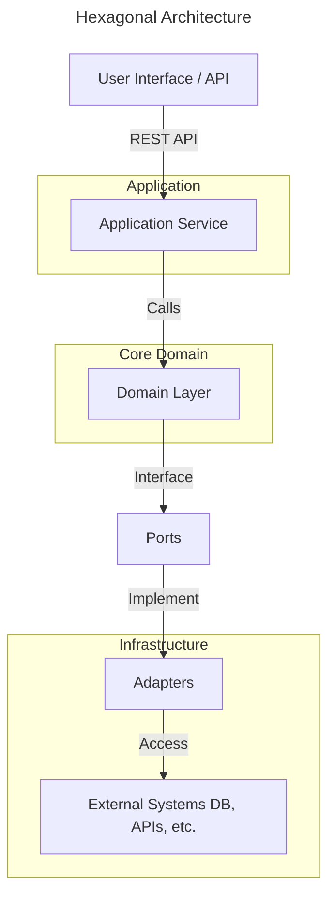

```mermaid
---
title: Hexagonal Architecture
---

graph TD;
A[User Interface / API] -->|REST API| B[Application Service]
B -->|Calls| C[Domain Layer]
C -->|Interface| D[Ports]
D -->|Implement| E[Adapters]
E -->|Access| F[External Systems DB, APIs, etc.]

    subgraph Core Domain
    C
    end

    subgraph Application
    B
    end

    subgraph Infrastructure
    E
    F
    end
```
